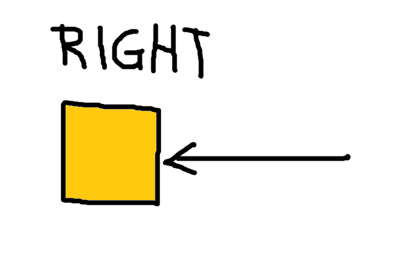

# NFT CYBERPUNK MARKETPLACE 2021

# OFFICIAL DOCUMENTATION

# ENTRY #2 FOR THE DECEMBER 2021 SHOWCASE

I made a lot of progress in building this website. Here are the tools I used :

- HTML
- CSS
- JAVASCRIPT
- REACT.JS
- TAILWINDCSS

# REVISIONS

I also learned a lot of things in improving the design of the website. For example, I used the css z-index property to put elements on top of each other. I also used the position-relative feature and position(top, left, bottom and right) feature to move elements anywhere I want.

 Remember though that the direction of the movement is not what you think it is.. 

for example...

# TOP

# BOTTOM

# LEFT

# RIGHT

# CREDITS

- It is also worth mentioning Meraki UI components and recharts for making the graphs/illustrations and the beautiful components possible.

- Credits given to unsplash for the pictures and also to tabler for the amazing graphic design.

- Credits also to me for using ADOBE PHOTOSHOP in editing the graininess of the background image. It looks extremely cool when deployed.
